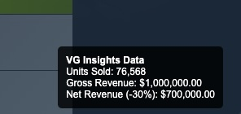

# VG Insights Tooltip

A Chrome extension that allows you to quickly retrieve and display sales data (Units Sold, Gross Revenue, and Net Revenue) of Steam games directly on any game page, using VG Insights API.

## Features

- **Instant Sales Info**: Displays units sold, gross revenue, and net revenue (with a -30% deduction for platform fees) for Steam games.
- **Simple and Fast**: The data appears directly on the Steam game page without any extra interaction required.
- **VG Insights API Integration**: Uses VG Insights API to provide accurate and up-to-date sales figures.

## How It Works

1. Install the extension in Chrome.
2. Visit any game page on [store.steampowered.com](https://store.steampowered.com).
3. The extension will automatically fetch the sales data for that game from VG Insights and display it in a tooltip overlay.

## Screenshots

## Installation

1. Clone this repository or download the zip file.
2. Go to `chrome://extensions/` in your Chrome browser.
3. Enable **Developer mode** by clicking the toggle at the top right.
4. Click on **Load unpacked** and select the directory where you cloned/downloaded this project.

## Usage

Once the extension is installed:

1. Navigate to any Steam game page (URL format: `https://store.steampowered.com/app/APPID`).
2. The extension will automatically fetch the game’s sales data from VG Insights.
3. You’ll see the following data displayed:
    - **Units Sold**
    - **Gross Revenue**
    - **Net Revenue (-30%)**
4. You can click this overlay to load the vginsights webpage of the game.

## Files Overview

- **manifest.json**: Defines the Chrome extension, including permissions, icons, background scripts, and content scripts.
- **background.js**: Listens for requests to fetch game data from VG Insights API and processes the response.
- **script.js**: Extracts the Steam AppID from the URL and displays the sales data overlay on the game page.
- **index.html**: Provides the popup when clicking on the extension’s icon.
- **icons**: Contains the icons used for the extension in various sizes.

## API Used

- **VG Insights API**: The extension fetches data for the Steam game being viewed using VG Insights API. It is the same API call that happens when you visit a games' page [here](https://vginsights.com).

## Permissions

The extension requires the following permissions:

- **Active Tab**: To interact with the currently active Steam game page.
- **Storage**: To store user preferences (future enhancements).
- **Scripting**: To inject the content script that displays the sales data.
- **Host Permissions**: Access to `vginsights.com` to retrieve sales data.

## Credits

Created by **Ioannis Karavas**.

## License

This project is licensed under the MIT License - see the [LICENSE](LICENSE) file for details.
